<picture>
  <source media="(prefers-color-scheme: dark)" srcset="./pradeep-banner.svg">
  <source media="(prefers-color-scheme: light)" srcset="./pradeep-banner-light.svg">
  
</picture>

 

  

 

## 🚀 About Me

> *"Great design is invisible — it just works. Great infrastructure? It's the backbone that makes that invisibility possible."*

I'm a **Senior System Engineer & Architect at CGI** with 8+ years bridging **UI/UX development** and **DevOps engineering** — a rare hybrid that lets me optimize both what users see *and* what powers it underneath.

**My Hybrid Edge**: I design interfaces users love *and* automate the infrastructure behind them. Whether scripting a deployment pipeline or building a landing page, I focus on **user experience + business impact**.

## 🎯 Currently Seeking

> **Open to remote Senior/Staff-level roles** in DevOps, Cloud Architecture, 
> Platform Engineering, or SRE — targeting US/UK-based companies.

**Ideal Role:**
- 🌍 Remote-first (US/UK timezone overlap)
- 🏗️ Enterprise infrastructure at scale (K8s, OpenShift, multi-cloud)
- 🔄 CI/CD pipeline design & DevSecOps integration
- 🤖 AI/ML infrastructure & agent ecosystems
- 📐 Architecture decision-making & technical leadership

## 💼 How I Work

- 📝 **Documentation-first** — I write ADRs, runbooks, and design docs before code
- 🔄 **Async-friendly** — Thrives in distributed teams across timezones
- 🧪 **Ship with confidence** — DevSecOps embedded in every pipeline
- 🎓 **Mentor & uplift** — Helps junior engineers grow into senior contributors
- 🏗️ **Architecture-minded** — Thinks in systems, not scripts

 

  

 

## 🏅 Open Source Impact

### 🔥 AG Kit — AI Agent Capability Expansion Toolkit

<table>
  <tr>
    <td><strong>Project</strong></td>
    <td><a href="https://github.com/vudovn/ag-kit" target="_blank">vudovn/ag-kit</a> — 47 skills, 20 specialist agents, production-ready workflows for AI coding assistants</td>
  </tr>
  <tr>
    <td><strong>Project Stats</strong></td>
    <td>⭐ 7.8k stars · 👁️ 118 watching · 🍴 1.5k forks</td>
  </tr>
  <tr>
    <td><strong>My Role</strong></td>
    <td>🥈 <strong>#2 contributor</strong> (3 commits, right after the project owner)</td>
  </tr>
  <tr>
    <td><strong>Contribution</strong></td>
    <td>+1,995 lines across 56 files — added 44 skill directories, 14 workflows, code-review-graph skill, orchestrator + project-planner agents</td>
  </tr>
  <tr>
    <td><strong>PRs</strong></td>
    <td><a href="https://github.com/vudovn/ag-kit/pull/71" target="_blank">#71</a> (original) → <a href="https://github.com/vudovn/ag-kit/pull/79" target="_blank">#79</a> (cherry-picked & merged with author credit preserved)</td>
  </tr>
  <tr>
    <td><strong>Recognition</strong></td>
    <td>📡 Featured on <a href="https://ag-kit.unikorn.vn/" target="_blank">ag-kit.unikorn.vn</a> — name & profile photo highlighted in the Contributors section</td>
  </tr>
</table>

> _"Thanks for the contribution. I handled this by cherry-picking the three commits from this PR so the original author credit is preserved."_
> — **<a href="https://github.com/vudovn" target="_blank">@vudovn</a>**, AG Kit maintainer

 

### Other Contributions

<table>
  <tr>
    <th>Project</th>
    <th>PR</th>
    <th>Impact</th>
  </tr>
  <tr>
    <td><a href="https://github.com/iam-veeramalla/aws-devops-zero-to-hero" target="_blank">aws-devops-zero-to-hero</a></td>
    <td><a href="https://github.com/iam-veeramalla/aws-devops-zero-to-hero/pull/145" target="_blank">#145</a> ✅ Merged</td>
    <td>Added Route 53 interview Q&A, CloudFormation overview, optimized project structure</td>
  </tr>
  <tr>
    <td><a href="https://github.com/firstcontributions/first-contributions" target="_blank">firstcontributions</a></td>
    <td><a href="https://github.com/firstcontributions/first-contributions/pull/99754" target="_blank">#99754</a></td>
    <td>Added to contributors list</td>
  </tr>
</table>

---

  

---

## ✍️ Latest Writing

Leveraging Terraform for remarkable DevOps achievements

Cleaning up unneeded snapshots and EBS volumes in AWS

---

## 🤝 Let's Connect

  
  
  

 

  

